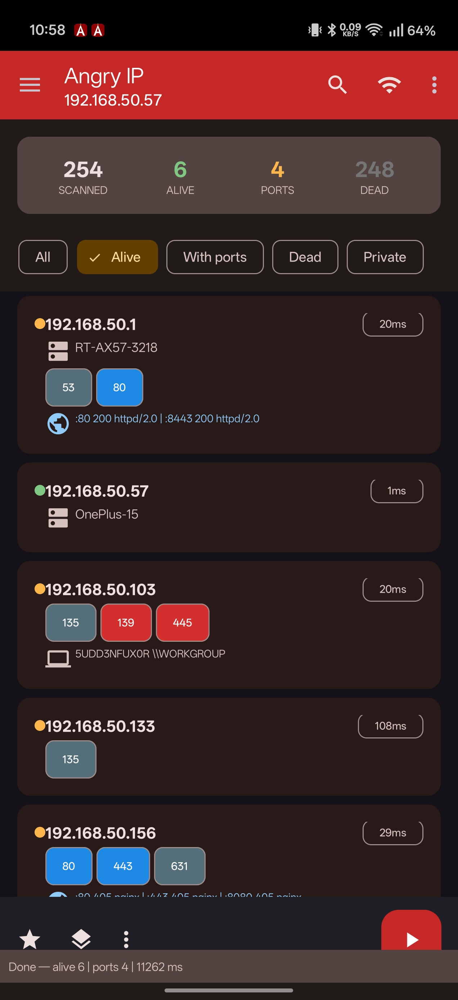
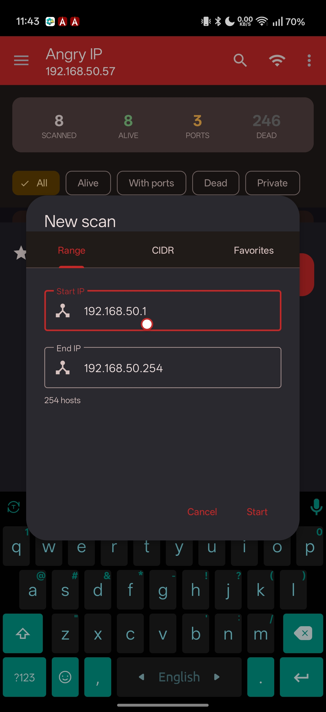
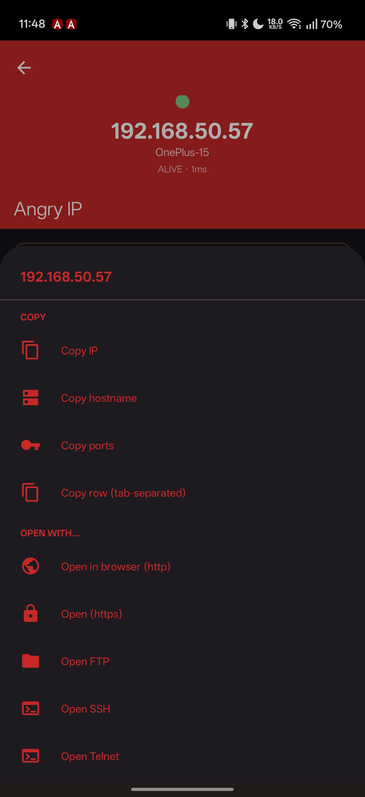
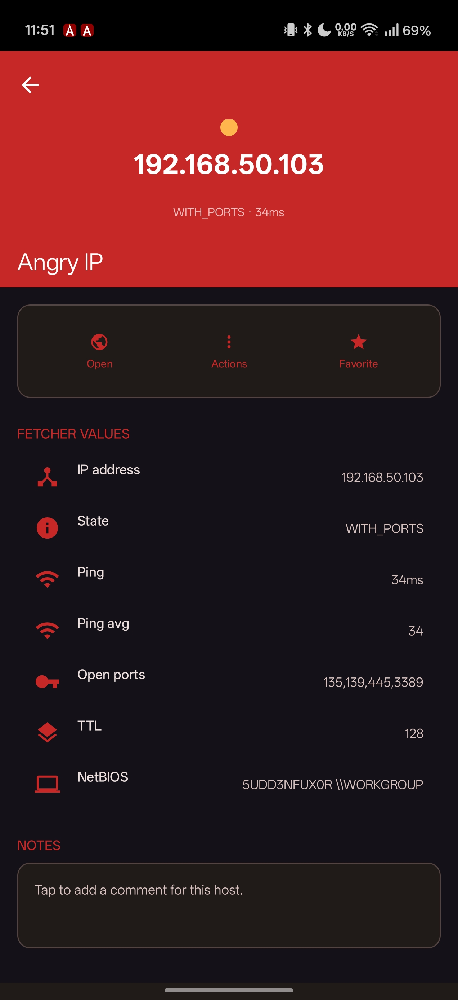
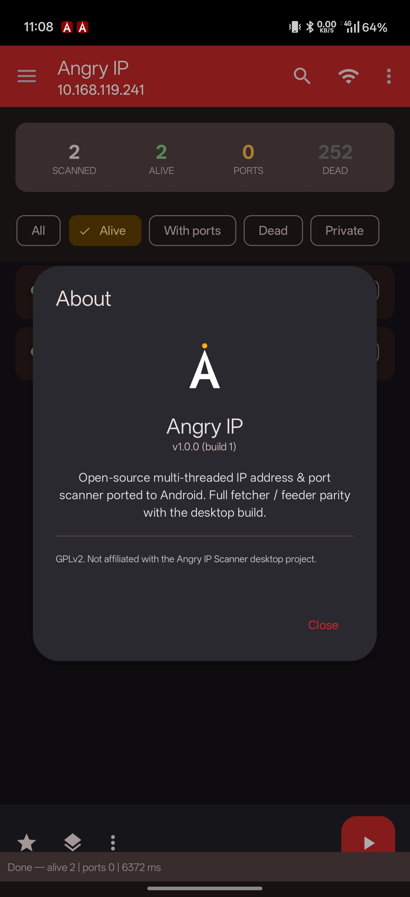

  

<h1 align="center">Angry IP Scanner for Android</h1>

  <strong>Professional multi-threaded IP address & port scanner for Android</strong> 
  Full fetcher / feeder parity with the desktop experience

  
  
  

---

## Download

**[⬇ Download Latest APK](https://github.com/undercoveritfirm/angry-ip-scanner-android/releases/latest)**

> Minimum: Android 7.0 (API 24) · Target: Android 14 (API 34)

---

## Features

### Scanning
- **IP Range scan** — start/end IP with live host count
- **CIDR scan** — subnet notation (192.168.1.0/24)
- **Random scan** — random IP generation for discovery
- **File feeder** — import IP lists from text files
- **Favorites** — save and recall frequent scan ranges
- **Continuous mode** — auto-rescan at configurable intervals
- **Scheduled scans** — background scanning via WorkManager
- **Auto-rescan on Wi-Fi change** — NetworkCallback triggers

### 16 Fetchers (Data Collectors)

| Fetcher | Description |
|---------|-------------|
| **Ping** | TCP RST probe + ICMP fallback (~1-5ms alive detection) |
| **Hostname** | Reverse DNS lookup (PTR record) |
| **Ports** | TCP connect scan — configurable port list, 64-port parallelism |
| **TTL** | IP time-to-live from ping response |
| **Packet Loss** | Percentage of ping probes with no reply |
| **Filtered Ports** | Detects firewalled (silent drop) ports |
| **Web Detect** | HTTP/HTTPS banner grab — Server, X-Powered-By |
| **HTTP Sender** | Custom HTTP request with configurable method/headers |
| **MAC Address** | ARP/neighbor table lookup (same L2 domain) |
| **MAC Vendor** | IEEE OUI database lookup |
| **NetBIOS Info** | UDP/137 NBSTAT query — computer name, workgroup |
| **HTTP Proxy** | CONNECT probe for open proxy detection |
| **Comments** | User-editable free-form notes per host |
| **SNMP sysDescr** | SNMPv1 sysDescr.0 query (community: public) |
| **SMB** | SMB2 negotiate — detects shares and SMB1 insecure hosts |
| **GeoIP** | Geographic IP lookup via ip-api.com |

### Export & Import
- **CSV, TXT, XML, JSON, IP:Port** export formats
- **Auto-detecting import** — CSV, JSON, XML, plain IP lists
- **Print / PDF** via Android Print framework
- **Share** results via any app

### Host Actions
- Open in Browser (HTTP/HTTPS), FTP, SSH, Telnet, RDP, VNC, SMB
- Custom URI opener
- Copy IP / Hostname / Ports / Full row
- Wake-on-LAN (WoL)
- Traceroute
- Netmask calculator
- Add to favorites
- Share host details
- Rescan single host

### Android-Native Features
- **Material 3** design with 6 named themes + light/dark/system
- **Quick Settings Tile** — start scan from notification shade
- **Home-screen widget** — last scan summary at a glance
- **App shortcuts** — long-press icon for quick actions
- **Foreground service** — scan survives backgrounding
- **Splash screen** with smooth transition
- **8 languages** — English, Spanish, French, German, Portuguese (BR), Russian, Chinese (Simplified), + system

### Performance
- **256 concurrent threads** with semaphore-bounded workers
- **TCP RST detection** — alive hosts respond in 1-5ms (as fast as ICMP)
- **/24 subnet scan in ~3-5 seconds**
- Zero thread delay, 1s ping timeout, optimized channel buffering

---

## Screenshots

  
  &nbsp;
  
  &nbsp;
  

  
  &nbsp;
  

---

## Permissions

| Permission | Purpose |
|------------|---------|
| `INTERNET` | Network scanning |
| `ACCESS_WIFI_STATE` | Detect current subnet |
| `ACCESS_NETWORK_STATE` | Network change detection |
| `FOREGROUND_SERVICE` | Keep scan alive in background |
| `POST_NOTIFICATIONS` | Scan status & completion alerts |
| `VIBRATE` | Scan completion haptic feedback |

---

## Developer

**Sharodshahi Al-Amin**
Undercover IT Firm

- 🌐 [undercoveritfirm.com](https://undercoveritfirm.com)
- 📢 [Telegram](https://t.me/undercoveritfirm)

---

## Disclaimer

> This application is designed for **authorized network administration and security auditing only**. Scanning networks without proper authorization is illegal in many jurisdictions. The developer assumes no liability for misuse. Always obtain written permission before scanning any network you do not own.

---

## Legal

© 2025-2026 Undercover IT Firm. All rights reserved.

This software is proprietary. Unauthorized reproduction, distribution, or reverse engineering is prohibited.
